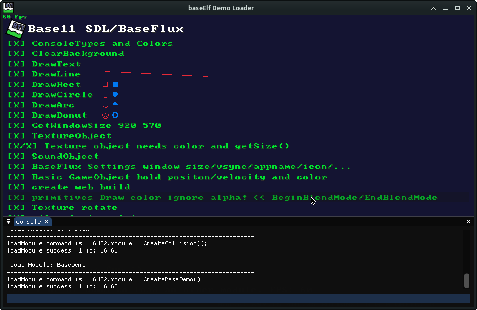

# BaseElf

A minimal Game Engine using [BaseFlux](https://github.com/ohmtal/BaseFlux/) as base for SDL3/ImGui/ResourceManager and ElfScript. It's also an enhanced example how to embed ElfScript.

This is a nice place to learn ElfScript (aka TorqueScipt ). 

### Build this:

    cmake -S . -B build
    cmake --build build -j4
    ./BaseElf
    
Where -j4 means compile with 4 cores. 
    
### Examples:

As default assets/main.elf is loaded as initial script. Script main.elf is a module loader for the modules in assets/modules. I usually copy  assets/modules/blank.elf to a new file to get started. The modules are added on $MODULES in main.elf.

The **build in console** can be open with the GraveAccent (usually under ESC key). You can use TAB (shift TAB for backward) to autocomplete a command. 

Script Bindings are listed in assets/script_stub.elf.

### Command line parameters:

    --chdir /path/to/my/custom/assets/
    --script /path/to/custom/script
        
### Basic Script 

    function onRender() {
        DrawText(80, 200 , "Congrats! You created your first window!", 2.0, GREEN);
    }
        
See also:

    - assets/minimal.elf
    - assets/basic.elf
        
### Script Editor for .elf

You can use every Text Editor you want. If you want syntax highlighting:
    
    - Easy: In you Editor set the type to c#, javascript or c++
    - VSCode/VSCodium: [Plugin](https://github.com/ohmtal/VSCode_TorqueScript)
    
In assets/script_stub.elf you find the current class, functions and constants definitions. Some editors (like vim) allow autocomplete when the file is loaded in background. 

### Related projects:

- [Raylib-ElfScript bindings](https://github.com/ohmtal/raylib-elfscript)
- [ElfFlux Raylib-ElfScript + Objects](https://github.com/ohmtal/ElfFlux)
