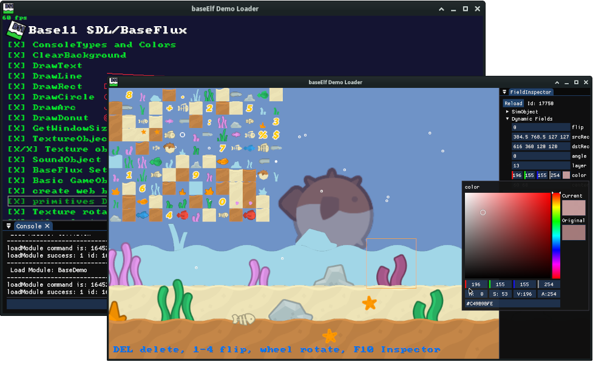

# ElfScript

👾 Now it's alive :D. 

Based on the Torque3D (4.x) source code this is my version of TorqueScript without Torque3D. 

## Notable changes:
- 🚀 **ElfScript:** Added fastpath for static float fields setDataField which is 28 times faster than before.
- 🚀 **ElfScript:** Syntax Highlight: You can set PoD types in c style: **Foo.MyVector = { 50.1, 78.5 };** 
- 🚀 **ElfScript:** Added #define with code preprocessor for byte code fast constant handling 
- 🤘 Added **ImGui** bindings to [ElfScript](https://github.com/ohmtal/ElfScript/tree/main/ElfScript/addons/ImGui). Demo: [BaseElf](./BaseElf)
- 🤘 Added **SDL3** Input (keyboard/mouse) handling and binding with events and polling to [ElfScript](https://github.com/ohmtal/ElfScript/tree/main/ElfScript/addons/SDL3). Demo: [BaseElf](./BaseElf)
- 😍 **ElfScript:** Added some handy console functions but this is my favorite: formatString(string format, ...) where you are able to add up to 31 parameter to really format a string :)
- **ElfScript:** Added Con::ConsoleDocForStub default false to make the classes/function dumps better human readable but kept the code when it's exported for an parser.
- **ElfScript:** Added IMPLEMENT_ENGINE_TYPE_TRAITS for non PoD console types (C linkage incompatible warning)
- Made it standalone
- Added optional GarabageCollectionSet
- EngineGlue for init/process/shutdown
- Ripped out some stuff i dont need like Taml
- Fixed some memory leaks :)
- Added auto enum binding as constants
- Added new Log functions
- Fixed Emscripten and Android Build  (Android problem: file loading does not work in apk - i added overwrite exec - example in OhmFlux/ElfTest)
- Replaced Math with Light Version (based on Torque2D) since the Types like Point3F are removed
- Since i also removed nearly all platform code - network is not implemented, because i need to add threading/mutex again in order to get it working. 

```
// Hello World example:
echo("Hello World");

// Variables:
$value = 5; //global Variable
%value = 5; //local Variable - inside function

// Objects:
$fooObj = new SimObject(Foo) {
    TypeF32 myValue = 1.0; // dynamic field can be defined in script 
    class = "FooClass"; // define a class name which can be used by different objects 
}; 
echo(Foo.myValue); // gives 1.0
echo($fooObj.myValue); // gives 1.0
function FooClass::print(%this) { // adding a custom method 
    // %this is a local variable which holds the SimObject-ID    
    echo(%this.myValue);
}
$fooObj.print();
echo($fooObj SPC Foo.getId()); //print SPC (space separated) object id of the foo object 
// You can also add a new dynamic field with assigning a value:
$fooObj.name = "Tom"; //bad idea overwrites object name
$fooObj.playerName = "Tom"; //a fields which is not defined by engine
echo(Tom.playerName);  // since i renamed it with .name= Foo is gone and Tom is here ;) 
$fooObj.dumpFields(); //list all fields of the object
$fooObj.dump(); //list all fields and methods of the object 
```
Since ElfScript is based on TorqueScript you can also read this [Documentation](http://wiki.torque3d.org/wiki:_scripter-start)


## Folder: ElfScript

The current codebase i use with the latest changes and fixes. 
Like the stuff in the TorqueScript folder but more cleanup unused Files and
Functions. 

- [ElfScript](./ElfScript/)

## Folder: BaseElf


Located in Folder [BaseElf](./BaseElf): 

A neat basic Game Engine using [BaseFlux](https://github.com/ohmtal/BaseFlux/) as 
base for SDL3/ImGui/ResourceManager and ElfScript. It's also an enhanced example 
how to embed ElfScript.

This is a nice place to learn ElfScript (aka TorqueScipt ). 

## Folder: TorqueScript

My first working Version. I will not change this anymore. I work on the code in the ElfScript folder.

## Folder: experimental 

Unfinished non functional attempt to make it much smaller. 

## Example / TestBed Application using OhmFlux:

- ~~added math (using also Ohmflux functions)~~
- added Platform functions (not complete)
- added some classes to test Sprite/Texture/Label/Font/Audio instance ....

[Ohmflux ElfTest](https://github.com/ohmtal/OhmFlux/tree/main/ElfTest)

## Raylib Bindings (raylib-elfscript):

- Using the raylib commands but in three Main-Callbacks:
    - function MainInit() { return true;}
    - function MainUpdate() {}
    - function MainShutDown() {}

[raylib-elfscript](https://github.com/ohmtal/raylib-elfscript)


## FIXME Windows 
Just tested BaseElf on Windows. All Projects using ElfScript needs:

```
# Windows - winVolume :: need to set on all builds 
if(MSVC)
    target_compile_options(${PROJECT_NAME} PRIVATE "/Zc:wchar_t-")
    target_compile_definitions(${PROJECT_NAME} PRIVATE 
        NOMINMAX 
        UNICODE 
        _UNICODE
    )
endif()
```

And if you want the binary in the base directory:

```
set_target_properties(${PROJECT_NAME} PROPERTIES
    RUNTIME_OUTPUT_DIRECTORY "${CMAKE_CURRENT_SOURCE_DIR}"

    # -- for windows: 
    RUNTIME_OUTPUT_DIRECTORY_DEBUG "${CMAKE_CURRENT_SOURCE_DIR}"
    RUNTIME_OUTPUT_DIRECTORY_RELEASE "${CMAKE_CURRENT_SOURCE_DIR}"
)
```

## Script related links

- [Torque3D](https://github.com/TorqueGameEngines/Torque3D)
- [KorkScript embeded TorqueScript](https://github.com/jamesu/korkscript/)
- [OGE3D enhanced Torque3D 3.x](https://github.com/ohmtal/OGE3D)
